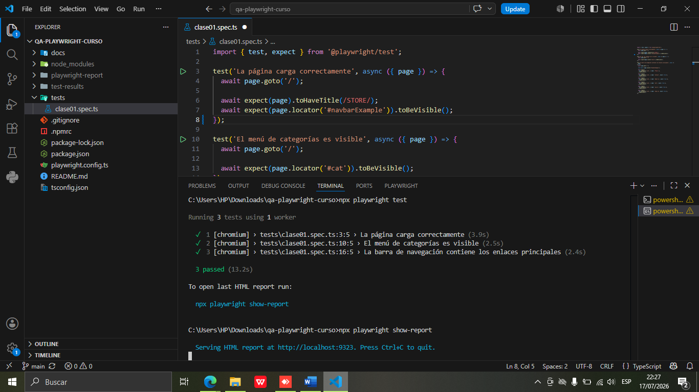
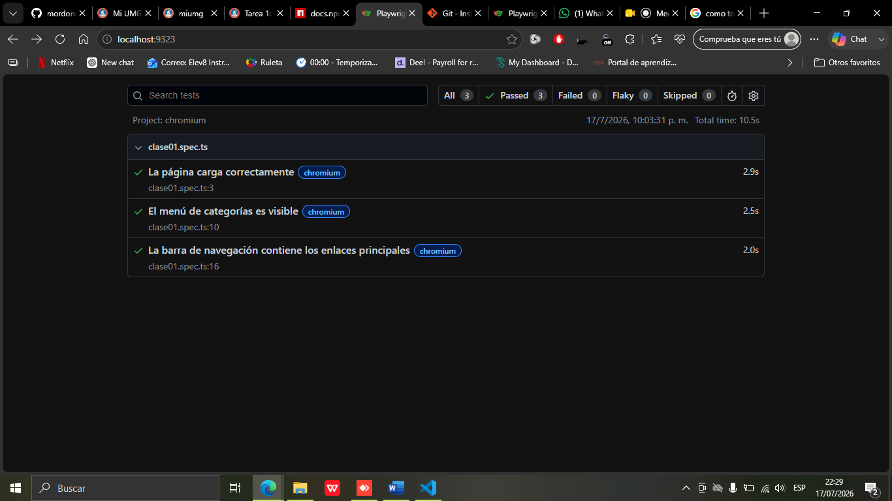
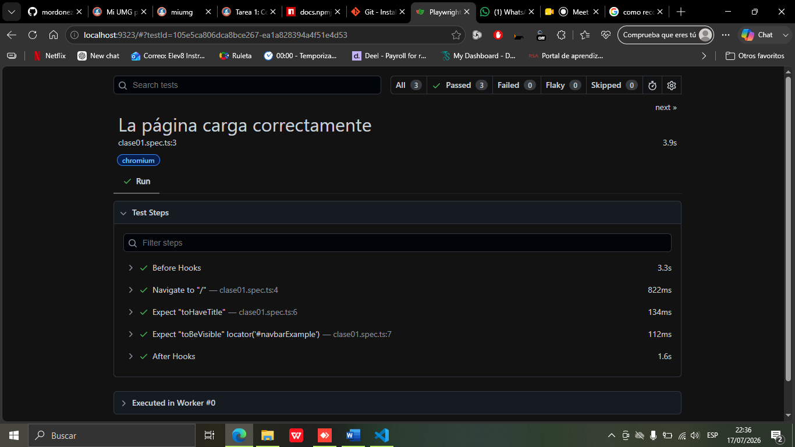
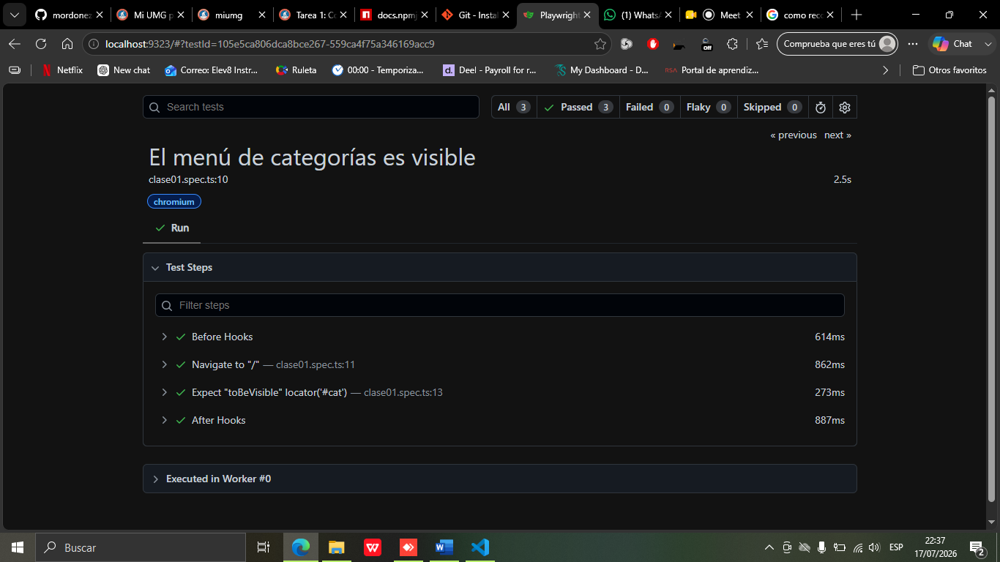
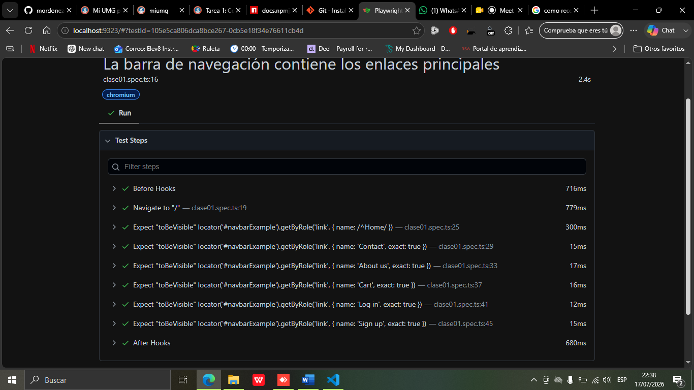

# Laboratorio 01 - Playwright con TypeScript

## Información del estudiante

- **Nombre:** Milton Ivan Ordóñez Orozco
- **Carné:** 1970-18-13542
- **Curso:** Aseguramiento de la Calidad del Software 
- **Grado:** Decimo Semestre
- **Universidad:** Universidad Mariano Gálvez de Guatemala

## Descripción

Proyecto de automatización de pruebas end-to-end utilizando Playwright y TypeScript.

Las pruebas se ejecutan sobre la aplicación web Demoblaze.

## Tecnologías utilizadas

- Node.js
- TypeScript
- Playwright
- Visual Studio Code
- Git y GitHub

## Versión de Node.js
    v20.19.3

## Evidencias de ejecución

### Ejecución de los tests

### Reporte general de Playwright

### Prueba de carga de la página

### Prueba del menú de categorías

### Prueba de la barra de navegación

